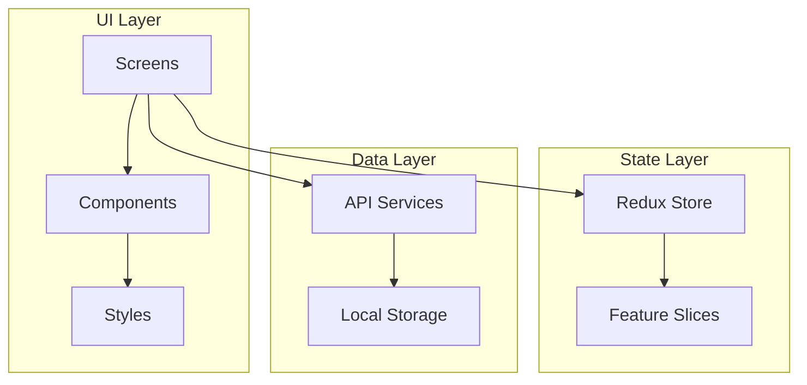

# PREDICTIQ Architecture

## Overview

PREDICTIQ is built with React Native following a modular architecture with clear separation of concerns.

## Core Layers



## Directory Structure

| Directory | Purpose |
|-----------|---------|
| `components/` | Reusable UI components |
| `screens/` | Full-screen views |
| `navigation/` | React Navigation config |
| `redux/` | State management |
| `services/` | API and data services |
| `styles/` | Design tokens & theme |

## State Management

Uses Redux Toolkit with two main slices:

- **scenarioSlice** - Manages prediction scenarios (CRUD operations)
- **settingsSlice** - App preferences and theme

## Navigation Flow

```
MainTabs (Bottom Tab Navigator)
├── Dashboard
├── History
└── Settings

Stack Navigator (Modal)
├── NewScenario
└── Results
```

## Data Flow

1. User creates scenario via `NewScenarioScreen`
2. `predictionService` calculates probability
3. Result stored in Redux via `scenarioSlice`
4. `storageService` persists to AsyncStorage
5. Dashboard/History screens reflect updates

## Key Design Decisions

- **TypeScript** for type safety
- **Redux Toolkit** over plain Redux for less boilerplate
- **Functional components** with hooks throughout
- **Semantic color system** for probability visualization
