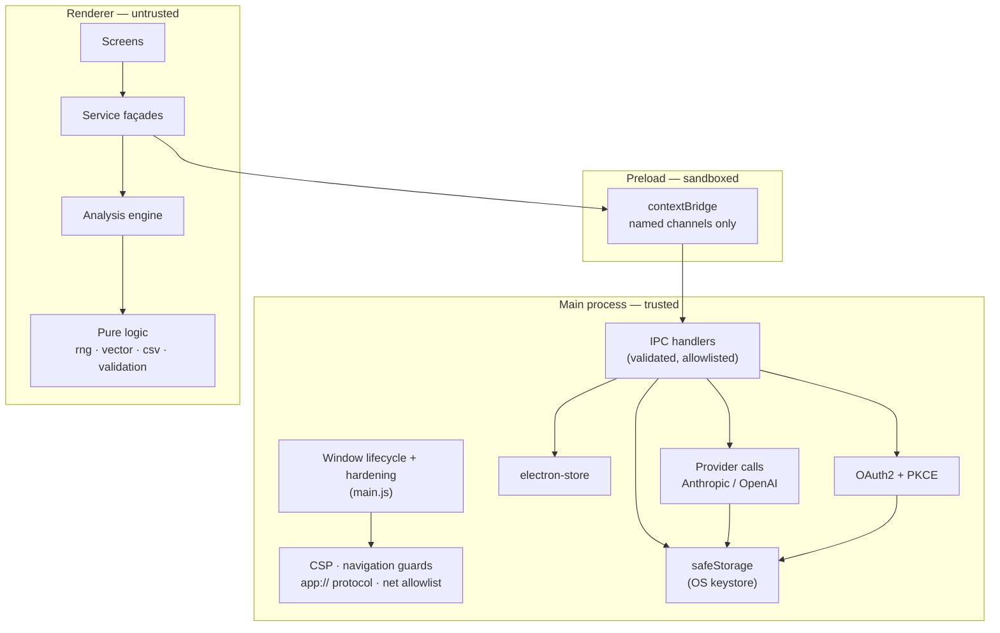

# PREDICTIQ Architecture

## Overview

PREDICTIQ is an Electron desktop application with a React Native Web renderer.
The organising principle is that **the security boundary is the process
boundary**: the renderer handles untrusted content and therefore holds no
secrets, has no filesystem access, and can reach exactly one external host.

## Process model



Two rules hold across the boundary:

1. Every argument crossing it is untrusted and is validated before use —
   channel name, store key, value shape, value size, and prototype safety.
2. Nothing sensitive crosses back. `secrets.read()` exists in the main process
   and is deliberately **not** wired to any IPC channel.

## Directory structure

| Directory | Purpose |
| --- | --- |
| `electron/lib/` | Main-process modules: contract, validation, security, store, secrets, IPC, provider calls, OIDC |
| `src/lib/` | Dependency-free pure logic: seeded RNG, vectorisation, CSV, import validation, scenario scoring |
| `src/services/` | Renderer service layer, including the typed bridge façade |
| `src/screens_web/` | Desktop screens (the shipped UI) |
| `src/screens/` | Parameter-driven guided builder screens (React Navigation) |
| `src/components/` | Charts, globe, ticker, error boundary |
| `src/redux/` | Scenario and settings slices for the guided builder |
| `src/styles/` | Design tokens and theme |

## The analysis engine

The engine is deliberately reproducible. Given the same scenario, council, and
engine settings, it returns the same assessment — a stored record in the audit
log can be re-derived rather than only re-run.

1. **Routing** — the scenario is tokenised and turned into a term-frequency
   vector. Each expert has a profile vector built from its focus keywords.
   Ranking is cosine similarity, minus a penalty for each blind-spot term
   present (`src/lib/vector.ts`, `src/services/ExpertVectorService.ts`).
2. **Isolated analysis** — each expert scores severity from its relevance plus a
   spread drawn from a PRNG seeded on `scenario | expertId | temperature`
   (`src/lib/rng.ts`). Temperature widens the spread; it does not introduce
   true randomness.
3. **Cross-examination** — high-severity findings are broadcast to the council
   and logged.
4. **Synthesis** — DEFCON is banded from the maximum and mean severity;
   probability, confidence, and factors are derived from the council's own
   findings (`src/services/predictionService.ts`).
5. **Augmentation (optional)** — if a provider is configured, the main process
   asks it for an executive summary over the council's findings. A failure here
   degrades the result to local output; it never fails the assessment.

## Data flow

```text
Scenario text
  → ExpertVectorService.selectCouncil      (cosine similarity)
  → GlobalRiskService.analyzeGlobalRisk    (seeded severity, DEFCON)
  → predictionService.analyzeScenario      (probability, confidence, factors)
  → aiService.summarize                    (optional, main process)
  → storageService.savePrediction          (validated IPC → electron-store)
  → History / reports / exports
```

## Two probability scales

The codebase carries two different probabilities. They are not
interchangeable and are typed separately:

| Type | Field | Meaning |
| --- | --- | --- |
| `PredictionResult` | `probability` | **Threat** probability — higher is worse |
| `Scenario` | `probability` | **Success** probability — higher is better |

## State management

Redux Toolkit backs the guided scenario builder (`scenarioSlice`,
`settingsSlice`). The desktop screens read engine settings and history through
`storageService`, which keeps a synchronous in-memory cache hydrated once at
start-up so screens can render without awaiting, while writes go through the
async IPC bridge.

## Key design decisions

- **Determinism over novelty** — an audit log whose entries cannot be reproduced
  is not an audit log.
- **Sandboxed preload with literal channel constants** — a sandboxed preload
  cannot `require` a relative module, so the channel names are duplicated there
  and a test asserts the copy never drifts from the contract.
- **`app://` over `file://`** — gives the renderer a real origin and lets the
  main process attach security headers to every response.
- **Fail closed** — no OS keystore means secrets are refused, not downgraded to
  plaintext.
